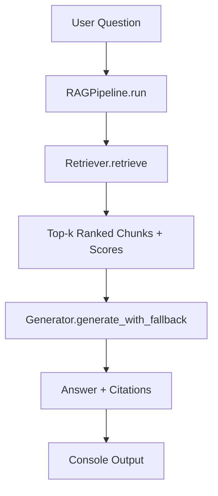
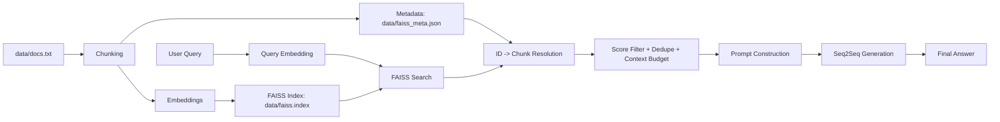

# RAG Flow Diagram and Concepts

This document explains the full flow of your current project and how each part works together.

## 1) What is RAG?

RAG (Retrieval-Augmented Generation) combines:

1. `Retriever`: finds relevant context from your document store.
2. `Generator`: writes an answer using that retrieved context.

Goal: better factual answers than generation-only models.

---

## 2) High-Level Pipeline



---

## 3) End-to-End Data Lifecycle



---

## 4) Module Responsibilities

### `src/rag/config.py`
- Centralizes file paths and runtime knobs.
- Important knobs:
  - `RETRIEVAL_K`
  - `FETCH_K`
  - `MIN_RELEVANCE_SCORE`
  - `MAX_CONTEXT_CHARS`
  - `CHUNK_SIZE_CHARS`
  - `CHUNK_OVERLAP_CHARS`
  - `CITATIONS_ENABLED`
  - `STEP_BY_STEP_MODE`
  - `DO_SAMPLE`

### `src/rag/retriever.py`
- Builds index:
  1. Read `docs.txt`
  2. Chunk text (with overlap)
  3. Embed chunks
  4. Save `faiss.index`
  5. Save `faiss_meta.json`
- Query retrieval:
  1. Encode user query
  2. Search FAISS (`fetch_k` candidates)
  3. Convert distances -> normalized relevance scores
  4. Filter by threshold
  5. Dedupe similar text
  6. Respect context budget
  7. Return structured chunks:
     - `chunk_id`, `source_doc_id`, `text`, `score`, `distance`

### `src/rag/generator.py`
- Creates grounded prompt from retrieved chunks.
- Attempts model generation.
- If output is weak or model fails:
  - switches to extractive fallback.
- Returns:
  - `answer`
  - `citations` (chunk IDs found in output or added by pipeline fallback).

### `src/main.py`
- CLI entrypoint and orchestration:
  1. Init config + retriever + generator
  2. Validate setup
  3. Build index if needed
  4. Interactive loop
- Output behavior:
  - default: prompt + answer only
  - `--debug`: full retrieval/generation logs

---

## 5) Query-Time Flow (Current Behavior)

1. User enters question.
2. Retriever returns top relevant chunks.
3. Generator tries model answer.
4. If model output is low quality, fallback produces cleaner extractive answer.
5. Console shows final answer (and full details only in debug mode).

---

## 6) Why This Design Works for Teaching

- Clear separation of concerns (`Config`, `Retriever`, `Generator`, `Pipeline`).
- Easy to inspect each stage independently.
- Retrieval quality improvements are visible:
  - chunking, filtering, ranking, context budget.
- Robust behavior even when generation model is weak/unavailable.

---

## 7) Run Modes

### Normal mode (minimal console)
```bash
python3 src/main.py
```

### Debug mode (detailed logs)
```bash
python3 src/main.py --debug
```

### Step-by-step teaching mode
```bash
STEP_BY_STEP_MODE=true python3 src/main.py --debug
```

---

## 8) Test Flow

Run all tests:

```bash
pytest -q
```

Run only generator behavior tests:

```bash
pytest -q tests/test_generator_prompt.py
```

Run one specific regression test:

```bash
pytest -q tests/test_generator_prompt.py::test_low_quality_model_output_switches_to_fallback
```

---

## 9) Practical Notes

- If `faiss_meta.json` is missing, the index rebuild path handles it.
- If model download fails due to SSL, retrieval still works; answer may rely on fallback.
- Better docs quality (`docs.txt`) directly improves answer quality.

---

## 10) Deep Concept Notes (Learning Section)

This section is intentionally more detailed for learning.

### A) Why chunking matters

If each line in `docs.txt` is very long, retrieval returns broad paragraphs that mix many topics.
That causes:
- weaker relevance for specific questions,
- noisy context for generation.

Your chunking strategy solves this by splitting large text into smaller, overlapping pieces.

Example:
- `CHUNK_SIZE_CHARS=700`
- `CHUNK_OVERLAP_CHARS=120`

Meaning:
- each chunk is about 700 chars,
- next chunk repeats ~120 chars from previous chunk,
- overlap prevents context from being lost at chunk boundaries.

### B) Why FAISS distance is converted to a score

FAISS returns L2 distance (smaller is better).
Humans reason better with “higher is better” scores.
So retrieval converts distance to normalized relevance score in range `[0, 1]`.

Then `MIN_RELEVANCE_SCORE` filters weak matches.

### C) Why oversampling (`FETCH_K`) helps

You may want final `k=3`, but first search top 10 (`FETCH_K=10`) candidates.
Then filter + dedupe + budget.

Without oversampling:
- strict thresholding can leave too few results.

With oversampling:
- better chance to keep top-quality final chunks.

### D) Why context budget exists

Even if many chunks are relevant, sending too much text to generator can:
- dilute focus,
- increase truncation risk,
- hurt small-model output quality.

`MAX_CONTEXT_CHARS` keeps prompt size controlled.

### E) Why fallback is still important

Small local models (like `t5-small`) sometimes:
- echo prompt instructions,
- give weak short output.

Your pipeline detects low-quality output and switches to extractive fallback.
This keeps answers useful even when generation quality is low.

---

## 11) Walkthrough with a Real Question

Question: `what happened in 1947`

### Step 1: Retrieval
- Query is embedded.
- FAISS returns top candidates.
- Filters keep best chunks (for example chunks around Indian independence and partition period).

### Step 2: Generation
- Prompt is built from question + retrieved chunk text.
- Generator tries to produce answer.
- If output is weak, fallback extracts best sentences from retrieved chunks.

### Step 3: Output
- Final answer shown to user.
- Source chunk IDs added as references.

Learning point:
- If retrieval chunks are good but answer is weak, bottleneck is generator quality.
- If retrieval chunks are bad, bottleneck is indexing/chunking/content quality.

---

## 12) Quality Tuning Guide (What to change first)

When answers are not good, tune in this order:

1. Improve `docs.txt` quality
2. Rebuild index
3. Tune retrieval knobs
4. Tune generation knobs

### A) Improve data first
- Keep facts clear and atomic.
- Avoid very long mixed-topic lines.
- Prefer one idea per sentence, one topic per line (before chunking).

### B) Retrieval tuning
- Increase `FETCH_K` from `10` -> `15` (if recall is low).
- Lower `MIN_RELEVANCE_SCORE` from `0.35` -> `0.25` (if too many empty retrievals).
- Increase `CHUNK_SIZE_CHARS` if chunks are too fragmented.

### C) Generation tuning
- Keep `DO_SAMPLE=false` for deterministic outputs.
- If output too short, increase `max_new_tokens`.
- If repetitive, keep/increase `no_repeat_ngram_size`.

---

## 13) Debugging Checklist by Stage

### Stage: Config
Symptoms:
- wrong files, wrong models.
Checks:
- print `rag.config`
- verify `docs_file`, `index_file`, `meta_file`, model paths.

### Stage: Index Build
Symptoms:
- retrieval poor or irrelevant.
Checks:
- rebuild index after changing docs:
  - delete old index/meta (optional), rerun build.
- inspect chunk count after indexing.

### Stage: Retrieval
Symptoms:
- correct topic not found in chunks.
Checks:
- run with `--debug`.
- inspect top chunk IDs and scores.
- check if score threshold is too strict.

### Stage: Generation
Symptoms:
- generic or instruction-like answer.
Checks:
- verify if fallback was triggered.
- if yes, model output quality is low.
- rely on fallback or switch to stronger local model.

### Stage: Output
Symptoms:
- too noisy console.
Checks:
- normal mode: `python3 src/main.py`
- verbose mode: `python3 src/main.py --debug`

---

## 14) Mini Glossary

- **Embedding**: vector representation of text.
- **FAISS**: library for fast nearest-neighbor vector search.
- **Chunk**: small text segment used as retrieval unit.
- **Top-k**: number of final retrieved items.
- **Oversampling**: retrieving more candidates than final k before filtering.
- **Grounding**: forcing answer to rely on retrieved evidence.
- **Fallback**: backup answer path when generation quality is poor.

---

## 15) Suggested Learning Exercises

1. Change `CHUNK_SIZE_CHARS` and compare retrieved chunks for same query.
2. Lower `MIN_RELEVANCE_SCORE` and observe retrieval quantity/quality tradeoff.
3. Ask typo queries (`happned`, `happend`) and inspect retrieval resilience.
4. Replace one docs line with intentionally wrong fact and observe output behavior.
5. Run same query in normal mode vs debug mode and map each log line to pipeline stage.

---

## 16) Simple Meaning of A -> G Flow

Flow:

`A[User Question] --> B[RAGPipeline.run] --> C[Retriever.retrieve] --> D[Top-k Ranked Chunks + Scores] --> E[Generator.generate_with_fallback] --> F[Answer + Citations] --> G[Console Output]`

### A) `User Question`
- What you type in terminal, for example:
  - `what happened in 1947`

### B) `RAGPipeline.run`
- Main coordinator function.
- It controls full query-time process:
  1. call retriever
  2. call generator
  3. return final structured result

### C) `Retriever.retrieve`
- Converts question into embedding.
- Searches FAISS index.
- Pulls candidate chunks from metadata.

### D) `Top-k Ranked Chunks + Scores`
- Retriever filters and ranks results.
- Keeps best chunks with fields like:
  - `chunk_id`
  - `source_doc_id`
  - `text`
  - `score`
- This is the evidence context passed to generator.

### E) `Generator.generate_with_fallback`
- Tries to generate natural answer from question + chunks.
- If generation fails or is low quality:
  - switches to extractive fallback answer.

### F) `Answer + Citations`
- Final response object includes:
  - `answer`
  - `citations` (chunk IDs)
- Citations tell which chunks support the answer.

### G) `Console Output`
- What user sees in terminal.
- Default mode:
  - question prompt + final answer only.
- Debug mode (`--debug`):
  - full pipeline logs and retrieval details.
